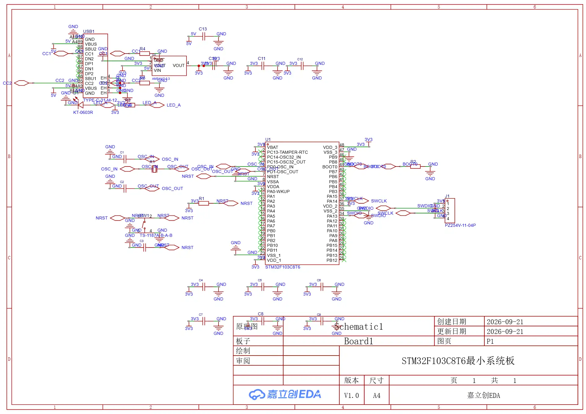
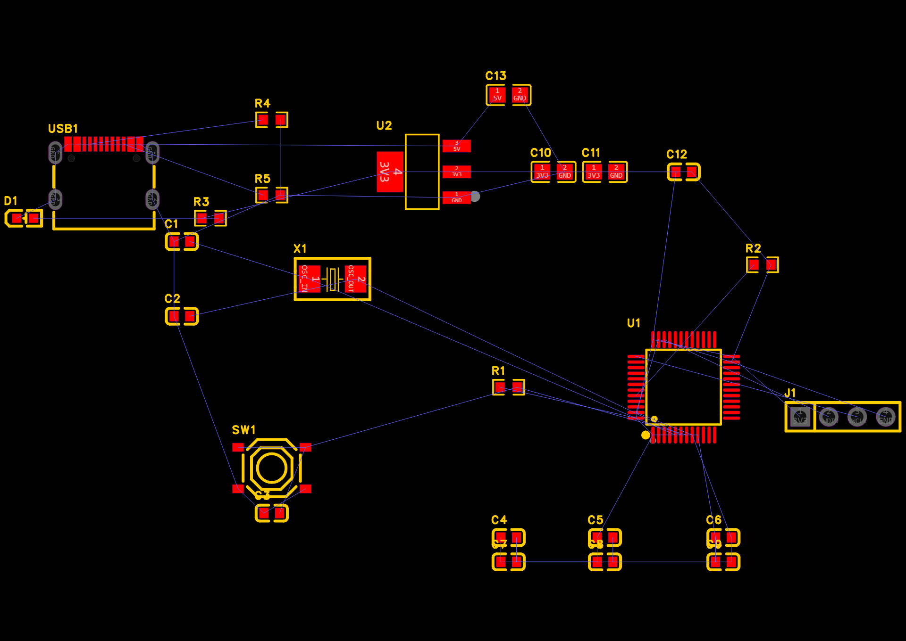
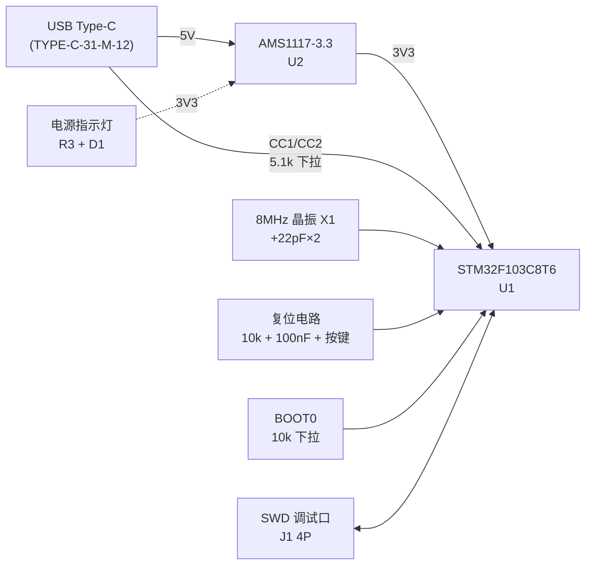

# STM32F103C8T6 最小系统板

嘉立创EDA专业版（LCEDA Pro）工程。本文档说明电路组成、网表、PCB 实现与当前完成状态。

| 项目 | 参数 |
|---|---|
| 主控 | STM32F103C8T6（LQFP-48，ARM Cortex-M3 @72MHz，64KB Flash / 20KB SRAM） |
| 供电 | USB Type-C 5V 输入 → AMS1117-3.3 LDO → 3.3V |
| 时钟 | 8MHz 无源晶振（HSE） |
| 板框尺寸 | 1800 × 1250 mil ≈ **45.72 × 31.75 mm** |
| 元件数 | 25（14 种物料） |
| 编辑器版本 | EDA Pro V3.2.117 |
| 原理图 ERC | 0 致命错误 / 0 错误 / 3 警告 |





---

## 1. 系统组成



## 2. 电源部分

### 2.1 5V 输入（USB Type-C）
- `USB1` 型号 `TYPE-C-31-M-12`，16 个焊盘：12 个信号 + 4 个屏蔽片
- VBUS（A4B9 / B4A9 合并焊盘）→ 网络 `5V`
- GND（A1B12 / B1A12）与 4 个屏蔽片 → 网络 `GND`（屏蔽片经竖直总线汇总后单点接地）
- **CC1 / CC2 各经 5.1kΩ 下拉到 GND**（R4 / R5）—— Type-C 作为受电设备（Sink）时，
  CC 脚必须下拉 5.1kΩ，否则源端不会输出电压。这是 Type-C 供电最常见的漏项。
- 未使用的 SBU1/SBU2、DP1/DP2、DN1/DN2 共 6 个引脚已打 no-connect 标记

### 2.2 3.3V LDO
- `U2` = `AMS1117-3.3`（SOT-223-3），VIN = 5V，VOUT（pin2 + pin4 散热片）→ `3V3`
- 输入侧：`C13` 10µF（0805）
- 输出侧：`C10` `C11` 各 10µF（0805）
- 该 LDO 为线性稳压，压差 5V→3.3V 时自身功耗较大，持续大电流需关注散热

### 2.3 去耦电容配置
U1 的**每一个电源引脚都配一颗独立的 100nF**，且紧邻引脚放置：

| 电源引脚 | 功能 | 去耦电容 |
|---|---|---|
| U1.1 | VBAT | C4 |
| U1.9 | VDDA | C5 |
| U1.24 | VDD_1 | C6 |
| U1.36 | VDD_2 | C7 |
| U1.48 | VDD_3 | C9 |
| （VDDA 侧附加） | 模拟电源补充 | C8（1µF） |

其余 100nF：`C3`（复位脚）、`C12`（3V3 群组）。

## 3. 时钟电路

- `X1` = `X50328MSB2GI`（YXC，5032 封装，**8MHz**）
- 负载电容 `C1` / `C2` = 22pF（C0G，0603）
- 连接：`X1.1 ↔ U1.5 (PD0/OSC_IN)`，`X1.2 ↔ U1.6 (PD1/OSC_OUT)`

> 22pF 是按 8MHz 晶振典型 12pF 负载电容 + PCB 杂散电容估算的常用值；
> 若换用不同 CL 规格的晶振，需按 `CL = C1·C2/(C1+C2) + Cstray` 重新取值。

## 4. 复位电路

- `R1` = 10kΩ 上拉到 `3V3`
- `C3` = 100nF 到 `GND`
- `SW1` = `TS-1187A-B-A-B` 轻触开关
- 网络 `NRST`（5 个连接点）：`U1.7` + `R1.2` + `C3.2` + `SW1.1` + `SW1.2`

**开关内部触点分组**（实测确认）：`{A,B} = {1,2}` 为一组，`{C,D} = {3,4}` 为另一组，两组互不导通。
因此 NRST 接 1/2、GND 接 3/4，按键按下时把 NRST 拉低。

## 5. 启动模式

- `BOOT0`（U1.44）经 `R2` 10kΩ **下拉到 GND** → 默认从主 Flash 启动
- 本板未引出 BOOT0 跳线；如需从系统存储器（串口下载）启动，需临时将 BOOT0 拉高

## 6. SWD 调试口

`J1` = `PZ254V-11-04P`（2.54mm 4P 排针），标准 SWD 顺序：

| 引脚 | 网络 | MCU 引脚 |
|---|---|---|
| 1 | 3V3 | — |
| 2 | SWDIO | U1.34 (PA13) |
| 3 | SWCLK | U1.37 (PA14) |
| 4 | GND | — |

## 7. 指示 LED

- `D1` = `KT-0603R`（红色 LED，0603）
- `R3` = 1kΩ 限流
- 回路：`3V3 → R3 → D1 → GND`

> **注意**：该 LED 接在 3V3 与 GND 之间，是**电源指示灯**（上电常亮），不受 MCU 控制。
> 若需要可编程的用户指示灯，应将 R3 的 3V3 端改接到某个 GPIO（如 PA1），
> 由 MCU 灌电流/拉电流驱动。

## 8. 网表

共 12 个电气网络 + 1 个空网络，77 个带网络焊盘；U1 的 33 个未用 GPIO 与 USB1 的 6 个未用脚共 39 个引脚已全部标记 no-connect。

| 网络 | 焊盘数 | 连接点 |
|---|---|---|
| `3V3` | 19 | U1.1(VBAT) U1.9(VDDA) U1.24(VDD_1) U1.36(VDD_2) U1.48(VDD_3) U2.2 U2.4 J1.1 R1.1 R3.1 C4~C12 的 1 脚 |
| `GND` | 31 | U1.8(VSSA) U1.23/35/47(VSS) U2.1 SW1.3 SW1.4 USB1 屏蔽片×4 USB1.A1B12 USB1.B1A12 J1.4 D1.2 R2.2 R4.2 R5.2 C1~C13 对应脚 |
| `5V` | 4 | U2.3(VIN) C13.1 USB1.A4B9 USB1.B4A9 |
| `OSC_IN` | 3 | U1.5 X1.1 C1.2 |
| `OSC_OUT` | 3 | U1.6 X1.2 C2.2 |
| `NRST` | 5 | U1.7 R1.2 SW1.1 SW1.2 C3.2 |
| `SWDIO` | 2 | U1.34 J1.2 |
| `SWCLK` | 2 | U1.37 J1.3 |
| `BOOT0` | 2 | U1.44 R2.1 |
| `LED_A` | 2 | R3.2 D1.1 |
| `CC1` | 2 | USB1.A5 R4.1 |
| `CC2` | 2 | USB1.B5 R5.1 |

## 9. PCB 实现

### 9.1 板框
矩形 `(0,0) – (1800,1250)` mil，即 **45.72 × 31.75 mm**，绘制在 Board Outline 层。

### 9.2 布局
25 个元件全部置于**顶层（TOP）**，均为 0° 朝向。布局按"按网络就近"原则组织：

| 区域 | 元件 |
|---|---|
| 左上 · USB 输入 | USB1、R4、R5（CC 下拉）、C13 |
| 右上 · 电源 | U2、C10、C11、C12 |
| 中上 · 时钟 | X1、C1、C2 |
| 中部 · 主控 | U1 及其 6 颗去耦电容 C4~C9 |
| 左侧 · 复位 | SW1、R1、C3 |
| 下侧 · 调试/指示 | J1、R2、C5、R3、D1 |

### 9.3 安装孔与 Mark 点

| 类型 | 数量 | 位置 (mil) | 参数 |
|---|---|---|---|
| M3 螺丝孔 | 4 | (200,200) (1600,200) (200,1050) (1600,1050) | 钻孔 3.2mm，焊盘 6.0mm，非金属化 |
| Mark 点 | 3 | (900,110) (1700,700) (150,700) | 铜点 1.0mm，阻焊开窗 2.0mm |

### 9.4 布线状态
**尚未布线。** 待完成：GND/3V3 铺铜、9 条信号网络（OSC_IN/OSC_OUT/NRST/SWDIO/SWCLK/BOOT0/LED_A/CC1/CC2）的手工走线、DRC 检查。

## 10. 设计规则检查（ERC）

当前状态：**0 致命错误 / 0 错误 / 3 警告**。3 条警告均为无害项：

1. 同网络焊盘重叠提示（`3V3、3V3`）——网络标识符号与焊盘物理重叠，不影响连通性
2. 同网络焊盘重叠提示（`GND、GND、GND、GND、GND、GND`）——同上，GND 标识密集所致
3. 库元数据不匹配（元件的属性与供应商编号不匹配）——库侧元数据提示，不影响制造

## 11. 已知问题与后续计划

| 项 | 说明 |
|---|---|
| 布线未完成 | 见 9.4，需完成铺铜 + 信号走线 + DRC |
| 无用户 LED | 当前 D1 为电源指示灯，非 MCU 可控（见第 7 节） |
| BOOT0 不可切换 | 未引出跳线，无法免拆进入系统存储器启动 |
| 无外部晶振 32.768kHz | 未配 LSE，RTC 只能走内部 RC |
| 无 USB 数据线 | D+/D- 未连到 MCU，仅用于取电 |

## 12. 文件说明

```
STM32F103C8T6-MinSys/
├── STM32F103C8T6-MinSys.epro2              工程源文件（原理图 + PCB + 符号 + 封装，可回导 EDA）
├── BOM/
│   ├── STM32F103C8T6-MinSys_BOM.csv          逐位号清单（25 行）
│   └── STM32F103C8T6-MinSys_BOM_采购汇总.csv 按料号汇总（14 种物料）
├── images/
│   ├── schematic-sheet1.webp                原理图预览
│   └── pcb-overview.webp                    PCB 预览
└── README.md                                本文件
```

### 关于 `.epro2` 的说明
`.epro2` 是嘉立创EDA专业版的工程容器（zip 格式），内部包含：
`project2.json`（元数据）、`IMAGE/*.webp`（各文档预览）、`<工程名>.epru`（工程数据正文）。

**它是本工程唯一的权威源文件**，可直接在 EDA 中「导入工程」还原全部原理图与 PCB。
Git 中以二进制处理（见仓库根 `.gitattributes`）。

### BOM 的生成方式
BOM 由工程源文件**离线解析**生成，不依赖 EDA 客户端在线。工具在仓库根 `tools/`：

```bash
# 在仓库根目录执行
python tools/gen_bom.py \
    hardware/STM32F103C8T6-MinSys/STM32F103C8T6-MinSys.epro2 \
    hardware/STM32F103C8T6-MinSys/BOM
```

之所以不用 EDA 官方的 `getBomFile()` 接口：该接口要求原理图文档处于激活状态，
依赖 GUI 状态、无法在无界面环境重复执行。离线解析则可重复、可进 CI。

`tools/epro_parse.py` 是 `.epro2` 的通用解析器（容器结构 + `.epru` 的 DOCHEAD 分隔格式），
可用于提取网表、布局、封装等其他数据。

## 13. 版本记录

| 日期 | 版本 | 内容 |
|---|---|---|
| 2026-09-21 | v0.1 | 原理图完成并通过 ERC；PCB 完成元件摆放、板框、安装孔与 Mark 点；布线待完成 |
